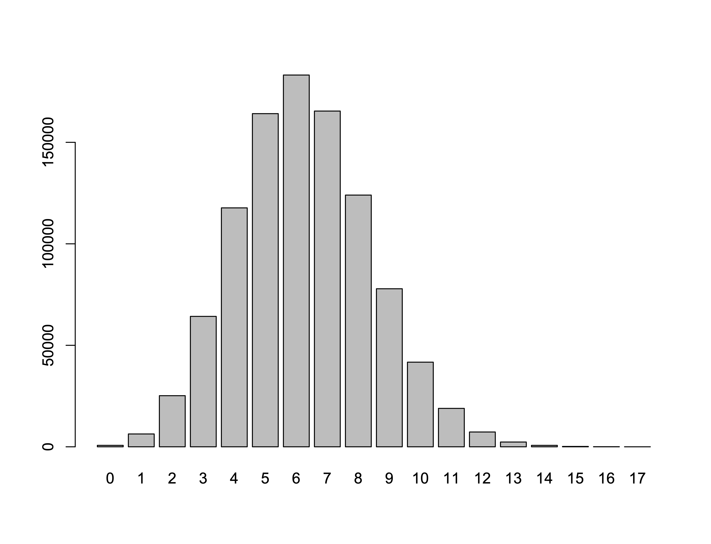
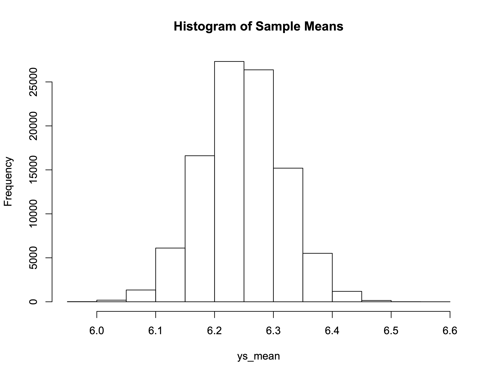
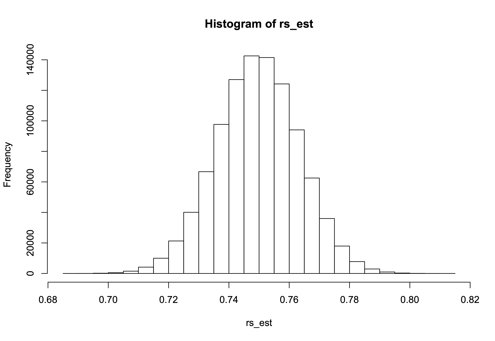

## Lesson 4 - Tuesday 2/4/20

Tonight's topic is inference. Science is an enterprise that seeks generalizable knowledge. In other words, we want to estimate scientifically interesting parameters -- using finite data sets -- and apply what we have learned to a scientifically interesting population. Inference is the "apply that information to scientifically interesting populations" part of this exercise. Normatively, we expect a compelling scientific presentation to include a parameter estimate (or estimates) accompanied by a principled measure of uncertainty; this information becomes the basis for us to apply our results to some broader population. Reading that is useful for this discussion comes from Wasserman (2004, Chapters 6-9).

### Estimating a Population Mean

Let's suppose there is a large population (1 million people) of prison releasees. Each prison releasee has some number, *y*, which is a count of prior convictions. Here is the population distribution of *y*:

```R
y <- c(rep(0,721),
       rep(1,6328),
       rep(2,25187),
       rep(3,64254),
       rep(4,117711),
       rep(5,164136),
       rep(6,183155),
       rep(7,165408),
       rep(8,124012),
       rep(9,77863),
       rep(10,41700),
       rep(11,18928),
       rep(12,7299),
       rep(13,2356),
       rep(14,719),
       rep(15,175),
       rep(16,45),
       rep(17,3))
table(y)
```

and the output is:

```Rout
> y <- c(rep(0,721),
+        rep(1,6328),
+        rep(2,25187),
+        rep(3,64254),
+        rep(4,117711),
+        rep(5,164136),
+        rep(6,183155),
+        rep(7,165408),
+        rep(8,124012),
+        rep(9,77863),
+        rep(10,41700),
+        rep(11,18928),
+        rep(12,7299),
+        rep(13,2356),
+        rep(14,719),
+        rep(15,175),
+        rep(16,45),
+        rep(17,3))
> table(y)
y
     0      1      2      3      4      5      6      7      8 
   721   6328  25187  64254 117711 164136 183155 165408 124012 
     9     10     11     12     13     14     15     16     17 
 77863  41700  18928   7299   2356    719    175     45      3 
> 
```

Here is a barplot showing the empirical distribution of *y* in the population.

<p align="center">

</p>

Now, suppose we want to answer the following question: "what is the mean value of *y* in this population?" The R code is:

```R
mean(y)
```

and the answer is:

```Rout
> mean(y)
[1] 6.247523
> 
```

Now, let's draw a single sample of size n=[sampsize] from this
population (with replacement) and calculate the sample mean and
standard error of the mean for that single sample:

```R
sampsize <- 1000
yss <- sample(y,size=sampsize,replace=T)
mean(yss)
sd(yss)/sqrt(sampsize)
```

and the output is:

```R
> sampsize <- 1000
> yss <- sample(y,size=sampsize,replace=T)
> mean(yss)
[1] 6.134
> sd(yss)/sqrt(sampsize)
[1] 0.066667
> 
```

Next, let's repeat this process [nsamples] times

```
nsamples <- 100000

ys_mean <- vector()
se_mean <- vector()

for(i in 1:nsamples)
  {
   ys <- sample(y,size=sampsize,replace=T)
   ys_mean[i] <- mean(ys)
   se_mean[i] <- sd(ys)/sqrt(sampsize)
   }

# look at the results

mean(ys_mean)
sd(ys_mean)
mean(se_mean)
```

and the output is:

```Rout
> nsamples <- 100000
> 
> ys_mean <- vector()
> se_mean <- vector()
> 
> for(i in 1:nsamples)
+   {
+    ys <- sample(y,size=sampsize,replace=T)
+    ys_mean[i] <- mean(ys)
+    se_mean[i] <- sd(ys)/sqrt(sampsize)
+    }
> 
> # look at the results
> 
> mean(ys_mean)
[1] 6.248071
> sd(ys_mean)
[1] 0.06845787
> mean(se_mean)
[1] 0.06843183
> 
```

Let's also look at a histogram of the sample means:

```R
hist(ys_mean,main="Histogram of Sample Means")
```

and the output is:

<p align="center">

</p>

As we can see, the mean of the standard errors is very close to the standard deviation of the sample means - which is what we expect. 

### Estimating a Population Proportion

Let's suppose there is a large population (1 million people) of prison releasees. Further suppose that 750,000 of these releasees get rearrested within 5 years of release -- implying a 75% recidivism rate. Here is the R code to enter the data:

```R
r <- c(rep(0,250000),rep(1,750000))
mean(r)
```

and the output is:

```Rout
> r <- c(rep(0,250000),rep(1,750000))
> mean(r)
[1] 0.75
> 
```

Next, we draw a sample of 1000 people from the original population and we calculate the recidivism rate and the standard error of the recidivism rate for the sample data:

```R
sampsize <- 1000
rss <- sample(r,size=sampsize,replace=T)
mean(rss)
sqrt(mean(rss)*(1-mean(rss))/sampsize)
```

and the output is:

```Rout
> sampsize <- 1000
> rss <- sample(r,size=sampsize,replace=T)
> mean(rss)
[1] 0.75
> sqrt(mean(rss)*(1-mean(rss))/sampsize)
[1] 0.01369306
> 
```

Let's see how this compares to the actual sampling distribution:

```R
nsamples <- 100000

rs_est <- vector()
rs_std <- vector()

for(i in 1:nsamples)
  {
   rs <- sample(r,size=sampsize,replace=T)
   rs_est[i] <- mean(rs)
   rs_std[i] <- sqrt(mean(rs)*(1-mean(rs))/sampsize)
   }

# look at the results

mean(rs_est)
sd(rs_est)
mean(rs_std)
```

and the output is:

```Rout
> nsamples <- 100000
> 
> rs_est <- vector()
> rs_std <- vector()
> 
> for(i in 1:nsamples)
+   {
+    rs <- sample(r,size=sampsize,replace=T)
+    rs_est[i] <- mean(rs)
+    rs_std[i] <- sqrt(mean(rs)*(1-mean(rs))/sampsize)
+    }
> 
> # look at the results
> 
> mean(rs_est)
[1] 0.750027
> sd(rs_est)
[1] 0.01377905
> mean(rs_std)
[1] 0.01368331
> 
```

Let's now introduce the idea of a confidence interval. For each of our samples, let's calculate a 95% confidence interval around our point estimate. Then, let's see how often our confidence interval actually traps the true population recidivism rate of 0.75.

```R
nsamples <- 1000000

rs_est <- vector()
rs_std <- vector()
rs_lcl <- vector()
rs_ucl <- vector()

mult <- qnorm(p=0.975)
mult

for(i in 1:nsamples)
  {
   rs <- sample(r,size=sampsize,replace=T)
   rs_est[i] <- mean(rs)
   rs_std[i] <- sqrt(mean(rs)*(1-mean(rs))/sampsize)
   rs_lcl[i] <- rs_est[i]-mult*rs_std[i]
   rs_ucl[i] <- rs_est[i]+mult*rs_std[i]
   }

# look at the results

mean(rs_est)
sd(rs_est)
mean(rs_std)
cl <- data.frame(rs_lcl,rs_ucl)
cl$flag <- rep(NA,nrow(cl))
cl$flag[rs_lcl<=0.75 & rs_ucl>=0.75] <- 1
cl$flag[rs_lcl>=0.75 | rs_ucl<=0.75] <- 0
table(cl$flag)
hist(rs_est)
```

and the output is:

```Rout
> nsamples <- 1000000
> 
> rs_est <- vector()
> rs_std <- vector()
> rs_lcl <- vector()
> rs_ucl <- vector()
> 
> mult <- qnorm(p=0.975)
> mult
[1] 1.959964
> 
> for(i in 1:nsamples)
+   {
+    rs <- sample(r,size=sampsize,replace=T)
+    rs_est[i] <- mean(rs)
+    rs_std[i] <- sqrt(mean(rs)*(1-mean(rs))/sampsize)
+    rs_lcl[i] <- rs_est[i]-mult*rs_std[i]
+    rs_ucl[i] <- rs_est[i]+mult*rs_std[i]
+    }
> 
> # look at the results
> 
> mean(rs_est)
[1] 0.7500165
> sd(rs_est)
[1] 0.01368219
> mean(rs_std)
[1] 0.01368364
> cl <- data.frame(rs_lcl,rs_ucl)
> cl$flag <- rep(NA,nrow(cl))
> cl$flag[rs_lcl<=0.75 & rs_ucl>=0.75] <- 1
> cl$flag[rs_lcl>=0.75 | rs_ucl<=0.75] <- 0
> table(cl$flag)

     0      1 
 53230 946770 
> 

```

<p align="center">

</p>

### Assignment #4 - Due Tuesday 2/11/20

Consider the following distribution of *y* representing the number of prior spells of incarceration for a population of incoming prison inmates. With samples of size *N* = 300, 

* Estimate the population mean. 
* Verify that the average of the sample means is close to the population mean. 
* Display your results with a histogram.
* Calculate the average of the standard errors
* Verify that the average of the standard errors is close to the standard deviation of the sampling distribution.
* Calculate a 95% confidence intervals for each sample you draw; verify that approximately 95% of the confidence intervals contain the true value of the population mean.

```Rout
y <- c(rep(0,4886),rep(1,16339),rep(2,25573),rep(3,24704),rep(4,16297),rep(5,8169),rep(6,3013),rep(7,821),
       rep(8,164),rep(9,31),rep(10,2),rep(11,1))
```
